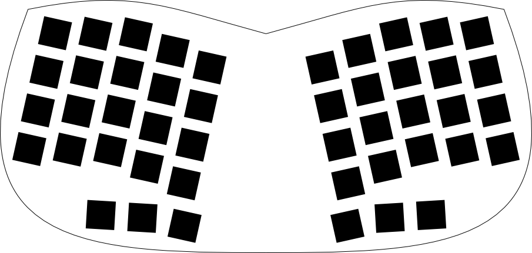
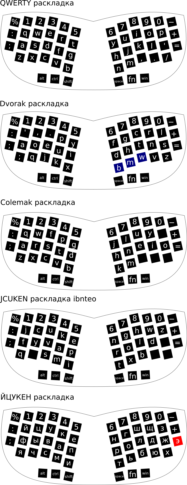
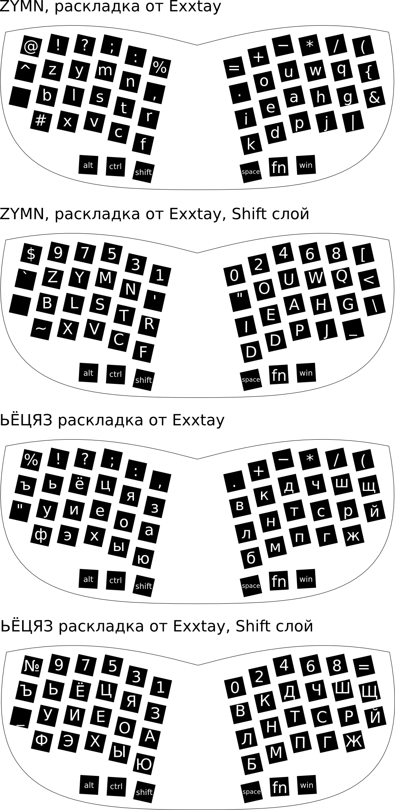
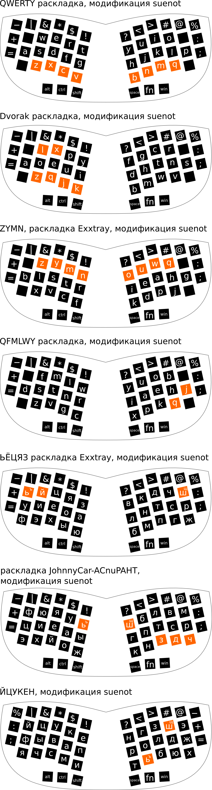
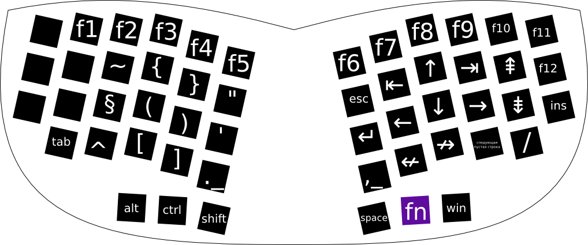
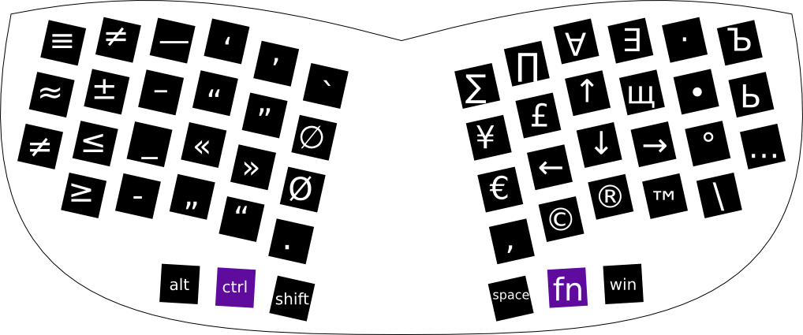
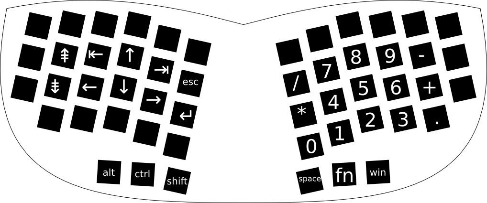

*Сейчас я помогаю ibnteo (а вот еще ссылка на его блог) в разработке 3 версии клавиатуры catboard (про вторую версию можно почитать тут), а также ее уменьшенной версии catboard s. Про разработку аппаратных раскладок к последней и пойдет речь.*

Основная идея аппаратной раскладки, в том, что клавиатуру можно подключить к любому устройству и печатать на своих раскладках, а также использовать горячие сочетания клавиш привязанные не к буквам, а к клавишам (например, ctrl+q в двораке будет обрабатывать системой как ctrl+z).

Уменьшенная версия будет включать в себя 52 клавиши.

Также я рассматривал убрать еще 6 клавиш, получилось бы вот так.

Чтобы плечи при наборе не напрягались между двумя половинками оставлено свободное место. Позже можно будет модернизировать текущую клавиатуру и установерить посередине трекбол (как [тут](http://geekhack.org/index.php?topic=43709.0)).

Предлагаю взглянуть на черновик будущих аппаратных раскладок для catboard s, которые я буду разрабатывать для прошивки клавиатуры.
Прошивка, как и сама клавиатура открытая. Прошивать клавиатуру легко.

### Стандартные раскладки:

“shift+alt” == “переключение языков”
“fn+z” == “tab”, “fn+ctrl+z”=”alt+tab”, перемещаться между программами можно с помощью стрелок “fn+j”, “fn+k”, “fn+l”, “fn+i” (пример для раскладки QWERTY)

Я убрал твердный знак из раскладки. Его можно набирать “shift+ь”. А вот прописные “Ь” и “Ъ” почти не используются, поэтому их надо набирать либо долгим удерживанием мягкого знака (мягкого знака с шифтом) или же набирать через fn слои.
“ъ” == “shift+ь”
“Ь” == набираются через fn слой || длительное нажатие на “Ь” и выбор нужной буквы || ctrl+ь
“Ъ” == набираются через fn слой или длительное нажатие на "Ь” и выбор нужной буквы || ctrl+shift+ь (ctrl+shift жмутся большим пальцем одновременно)

Proin nec nunc tellus. Donec sapien leo, ornare quis condimentum a, euismod sit amet augue. Aliquam tincidunt mauris at arcu suscipit, quis scelerisque justo rhoncus. Vestibulum lobortis dui at odio lacinia mattis. Praesent nunc urna, bibendum ut dui eget, consequat suscipit leo. Curabitur auctor vel dui fermentum auctor. Sed ultrices ligula mauris, id blandit sapien ultrices id. Morbi volutpat tortor quis ex convallis aliquam. Nunc eleifend risus eget dui condimentum scelerisque.

### Раскладки Exxtay:

Его раскладка рассчитана на полноразмерную клавиатуру, поэтому у меня получилось уместить не все символы. Также он планирует переделывать свои раскладки и разрабатывать под них собственную клавиатуру.

### Модифицированные мной раскладки:

C буквами “Ш” и “Щ” ситуация похожа на набор “Ь” и “Ъ”.
“Ш” == “shift+ш”
“щ” == “ctrl+ш”
“Щ” == “ctrl+shift+ш” (ctrl+shift жмутся большим пальцем одновременно)

Подробнее про раскладку JohnnyCar-ACnuPAHT можно прочитать тут.

### Fn слой

Здесь стрелки служат для перемещения по тексту. Можно перемещаться по тексту и печатать, не убирая руки в фыва-олдж.

### Fn+ctrl слой

Мой набросок на типографский слой (наверно, их будет несколько). Скорее-всего от него и вовсе откажусь. Еще очень сырой. Нужно правильно расставить типографские символы, добавить куда-то недостающие и выбрать кнопки для акцентов.

Стрелки здесь символы.
“fn+space” == “неразрывный пробел”

Также хотелось бы реализовать набор типографских символов также в стиле os x клавиатур и в стиле типографской раскладки Бирмана, чтобы пользователь клавиатуры сам выбрал удобный ему способ набора хитрых зкорючек и специальных символов.

### Слой с цифровой клавиатурой

Слой включается и выключается сочетанием “shift+fn+win”.

Что касается моего выбора. Я собираюсь отказываться от стандартных раскладок ЙЦУКЕН и QWERTY в пользу раскладок JohnnyCar-ACnuPAHT и QFMLWY. Переучивание займет месяцы.

Помимо представленных раскладок существуют и другие: [Диктора](http://ergosolo.ru/reviews/history/alternative_layouts/), [Зубачева](http://nabiraem.ru/blogs/study/5514/), [Lexanni](http://blog.klavogonki.ru/profile/243733), [Переборыча](http://klavogonki.ru/u/#/123190/) и [GoodLoki](http://blog.klavogonki.ru/profile/260895). А вот [еще латинские раскладки и их качественное сравнение](http://mkweb.bcgsc.ca/carpalx/?popular_alternatives).

Следите за новостями в группе [в контакте](http://vk.com/klavaorg).