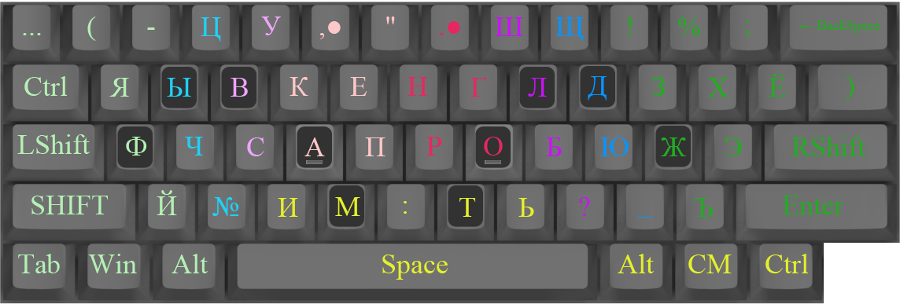

<div align="center"></div>

*Сохраняю для себя информацию про раскладку Переборыча. Сам я раньше был ее фанатом. Изучал ее и делал аналогичный 12-ти пальцовый вариант на базе Дворака. Далее привожу слова Переборыча:*

Для "12-пальцевого" набора я приспособил такую вот раскладочку:

Подсказка: клик по картинке раскрывает её в большем разрешении.
Цвета для раскраски зон взяты из [TS](http://klavogonki.ru/forum/academy/161/). Переназначения сделаны программой AHK, пример работы с ней есть в записи ["Pereborych style"](http://klavogonki.ru/u/#/123190/journal/52be82057bf62d07398f6553).

**Основная фишка:** чтобы удобнее было набирать большими пальцами клавиши нижнего ряда, я поднял кнопки безымянного и среднего пальцев на один ряд вверх.

Клавиша **CapsLock** отсутствует за ненадобностью. Её роль выполняет **SHIFT**. **LShift** и **RShift** позволяют без зажиманий набирать прописными следующую букву в правой и левой половинах клавиатуры соответственно.

**[,●]** и **[.●]** - **зпт** и **тчк** с автопробелом. Без автопробела **зпт** присутствует на [**RShift**, **многоточие**], а просто **тчк** на [**LShift**, **ъ**]. Напоминаю, что удерживать Шифты при этом не требуется.

Клавиша [**й**] практически не востребована, потому что [**ь**] при нажатии после гласной, почти полностью берёт всю работу на себя. Т.е. "ой", "ай", "уй" и т.п. набирается как [**о**, **ь**], [**а**, **ь**]...

Клавиши [**М**] и [**И**] никогда не нажимаются друг за другом: для сочетания "ми" предназначены клавиши [м, щ], а для "им" - [**и**, **ъ**]. Точно также "ть" набирается как [**т**, **ц**], а "тц" как [**т**, **LShift**, **ц**]. Всё для того, чтобы не усложнять работу больших пальцев.

На последовательность [**LShift**, **)**] подвешено переключение на цифровую раскладку, где цифры расположены на буквах: **0123456789** как [**одтчпшсвен**] (по первым буквам названий цифр). Нажатие [**)**] отключает цифровую раскладку.

*Взято из [старого профиля Переборыча](http://klavogonki.ru/u/#/191670/journal/52be892d7bf62d073991bc69)*

Чтобы печатать как Переборыч нужно:
Чтобы печатать как я, нужно:
1. Установить машинописную раскладку
Пуск -> Панель управления -> Язык и региональные стандарты -> Языки -> Подробнее -> Добавить -> *Русская (машинопись)
2. Скачать и установить AutoHotkey, создать обычный текстовый файлик, скопировать туда нижеследующий код скрипта, переименовать расширение с txt на ahk и запустить.

```
;TEMP:
;sc00E::Send {sc14B}{sc153}; BackSpace -> Left + Delete
;+sc03A::Send ^{sc00E}; Shift+CapsLock -> Ctrl+BackSpace
;sc00E::Capslock; BackSpace -> CapsLock

;WORKING:
sc029::Send {sc008}{sc008}{sc008}; | -> многоточие
sc035::Send {sc01B}; ё -> ъ
sc01B::Send {sc035}; ъ -> ё
+sc035::Send {sc007}; Ё -> зпт
+sc01B::Send +{sc035}; Ъ -> Ё
sc004::Send +{sc02B}; / -> (
sc11C::Send {sc039}; ц.Enter -> Space
sc04A::Send {sc00E}; ц.- -> BackSpace
sc007::Send {sc007}{sc039}; зпт -> зпт + Space
sc008::Send {sc008}{sc039}; тчк -> тчк + Space
+sc02B::Send {sc008}; ( -> тчк

;HOTSTRINGS (NEW!)
:?*:вй::вств
;=== Война с пробелами ===
;:*:-::-{Space}; "знак-" -> "знак-пробел"
;:*:,-::,-{Space}
;:*:.-::.-{Space}
;=== Самое длинное -> Самое короткое ===
:?*:кщ::ки
;=== Гласные + знаки ===
:?*:аь::ай
:?*:ыь::ый
:?*:еь::ей
:?*:иь::ий
:?*:уь::уй
:?*:ый::ый

;FUTURE:
;sc032::Send {sc02C}; ь -> я
;sc032::Send {sc02C}; ъ -> й
```